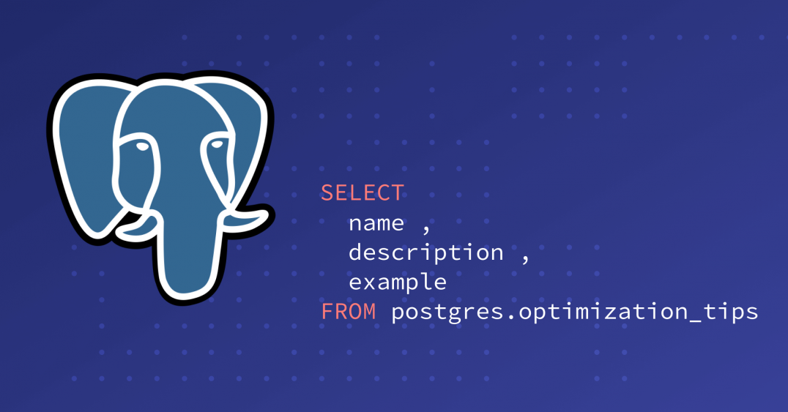

<h2 align="center">Performance tips (EXPLAIN)</h2>
<br/>
<div align="center">
    
</div>


Hiệu suất của các câu query có thể bị ảnh hưởng bởi nhiều thứ. Một số vấn đề có thể được
cải thiện bởi bởi người dùng, trong khi một số khác là do thiết kế của hệ thống.

Trong bài viết này sẽ sẽ đề cập đến **EXPLAIN** keyword để cải thiện hiệu suất của PostgreQL

PostgreSQL đưa ra một kế hoạch cho mỗi query thực hiện. Việc chọn phương án phù hợp với cấu
trúc và các thuộc tính của dữ liệu là hoàn toàn quan trọng để có hiệu suất tốt, vì vậy hệ
thống bao gồm một bộ lập kế hoạch phức tạp để cố gắng chọn các phương án tốt nhất. Bạn có thể
sử dụng lệnh ``EXPLAIN`` để xem kế hoạch query mà planer ra cho bất kỳ query nào. Đọc kế hoạch 
là một việc khó đòi hỏi kiến thức rộng

Đây là một ví dụ.
```
EXPLAIN SELECT * FROM employee;

                         QUERY PLAN
-------------------------------------------------------------
 Seq Scan on employee  (cost=0.00(1)..458.00(2) rows=10000(3) width=244(4))
```

Các con số được trích dẫn bởi EXPLAIN là:

1. Chi phí khởi động ước tính (Thời gian tiêu tốn trước khi quá trình quét đầu
ra có thể bắt đầu, ví dụ: thời gian để thực hiện việc sắp xếp trong một node.)
2. Tổng chi phí ước tính (Nếu tất cả các hàng được truy xuất, mặc dù chúng có
thể không: ví dụ: truy vấn có mệnh đề LIMIT sẽ ngừng thanh toán tổng chi phí
của node đầu vào của node Kế hoạch giới hạn.)
3. Số lượng hàng ước tính được xuất ra bởi node kế hoạch này
4. Chiều rộng trung bình ước tính (tính bằng byte) của các hàng do node kế
hoạch này xuất ra

note: Chi phí được đo lường theo đơn vị tùy ý, chi phí của một node cấp trên
bao gồm chi phí của tất cả các node con của nó. Chi phí không tính đến thời
gian dành cho việc truyền kết quả cho khách hàng, điều này có thể là một yếu
tố quan trọng trong. Nhưng người lập kế hoạch bỏ qua nó bởi vì nó không thể
thay đổi nó bằng cách thay đổi kế hoạch.

nếu bạn thử.
```
SELECT relpages, reltuples FROM pg_class WHERE relname = 'employee';
```

Bạn sẽ thấy rằng employee có 358 disk page và 10000 row. Chi phí ước tính là
(disk pages read * ``seq_page_cost``) + (rows scanned * ``cpu_tuple_cost``).
Theo mặc định, ``seq_page_cost`` là 1,0 và ``cpu_tuple_cost`` là 0,01. Vậy chi
phí ước tính là (358 * 1,0) + (10000 * 0,01) = 458.

Bây giờ, hãy sửa đổi truy vấn để thêm điều kiện WHERE:
```
EXPLAIN SELECT * FROM employee WHERE unique1 < 7000;

                         QUERY PLAN
------------------------------------------------------------
 Seq Scan on employee  (cost=0.00..483.00 rows=7033 width=244)
   Filter: (unique1 < 7000)
```

Lưu ý đầu ra của EXPLAIN hiển thị mệnh đề WHERE đang được áp dụng như một
điều kiện '**Filter**'; Điều này có nghĩa là node kế hoạch kiểm tra điều kiện
cho mỗi hàng mà nó quét và chỉ xuất ra những hàng vượt qua điều kiện. Ước tính
của các hàng đầu ra đã giảm xuống do mệnh đề WHERE. Tuy nhiên, quá trình quét
vẫn phải truy cập tất cả 10000 hàng, vì vậy chi phí không giảm. Trên thực tế,
nó đã tăng lên một chút (chính xác là 10000 * ``cpu_operator_cost``) để phản
ánh thời gian CPU để kiểm tra điều kiện WHERE.

Số hàng thực tế mà truy vấn này sẽ chọn là 7000, nhưng ước tính số hàng chỉ là
gần đúng. Nếu bạn cố gắng lặp lại thử nghiệm này, bạn có thể sẽ nhận được một
ước tính hơi khác. Hơn nữa, nó sẽ thay đổi sau mỗi lệnh **ANALYZE**, bởi vì số
liệu thống kê do **ANALYZE** tạo ra được lấy từ một mẫu ngẫu nhiên của bảng.

Giời hãy thử với điều kiện hạn chế hơn:
```
EXPLAIN SELECT * FROM employee WHERE unique1 < 100;

                                  QUERY PLAN
------------------------------------------------------------------------------
 Bitmap Heap Scan on employee  (cost=2.37..232.35 rows=106 width=244)
   Recheck Cond: (unique1 < 100)
   ->  Bitmap Index Scan on employee_unique1  (cost=0.00..2.37 rows=106 width=0)
         Index Cond: (unique1 < 100)
```

Ở đây người lập kế hoạch đã quyết định sử dụng kế hoạch hai bước: node kế
hoạch dưới cùng truy cập một chỉ mục để tìm vị trí của các hàng phù hợp với
điều kiện chỉ mục và sau đó node kế hoạch trên thực sự lấy các hàng đó từ bảng
chính. Việc tìm nạp các hàng một cách riêng biệt đắt hơn nhiều so với việc đọc
chúng một cách tuần tự, nhưng vì không phải tất cả các trang của bảng đều phải 
được truy cập, điều này vẫn rẻ hơn so với quét tuần tự. (Lý do sử dụng hai mức 
kế hoạch là node kế hoạch phía trên sắp xếp các vị trí hàng được chỉ mục xác 
định theo thứ tự vật lý trước khi đọc chúng, để giảm thiểu chi phí của các lần 
tìm nạp riêng biệt. 'bitmap' được đề cập trong tên node Là cơ chế thực hiện 
việc sắp xếp.)

Nếu điều kiện WHERE đủ chọn lọc, người lập kế hoạch có thể chuyển sang kế hoạch quét chỉ mục 'đơn giản':

```
EXPLAIN SELECT * FROM employee WHERE unique1 < 3;

                                  QUERY PLAN
------------------------------------------------------------------------------
 Index Scan using employee_unique1 on employee  (cost=0.00..10.00 rows=2 width=244)
   Index Cond: (unique1 < 3)
```

Trong trường hợp này, các hàng trong bảng được tìm nạp theo thứ tự chỉ mục,
điều này làm cho chúng thậm chí còn đắt hơn đọc, nhưng có rất ít nên chi
phí bổ sung cho việc sắp xếp các vị trí hàng là không đáng. Bạn sẽ thường thấy
loại kế hoạch này cho các truy vấn chỉ tìm nạp một hàng và cho các truy vấn
yêu cầu điều kiện ORDER BY khớp với thứ tự chỉ mục.

Một điều kiện khác vào mệnh đề WHERE:
```
EXPLAIN SELECT * FROM employee WHERE unique1 < 3 AND stringu1 = 'xxx';

                                  QUERY PLAN
------------------------------------------------------------------------------
 Index Scan using employee_unique1 on tenk1  (cost=0.00..10.01 rows=1 width=244)
   Index Cond: (unique1 < 3)
   Filter: (stringu1 = 'xxx'::name)
```

Điều kiện được thêm vào stringu1 = 'xxx' làm giảm ước tính hàng đầu ra, nhưng
không làm giảm chi phí vì chúng ta vẫn phải truy cập vào cùng một nhóm hàng. 
Lưu ý rằng mệnh đề stringu1 không thể được áp dụng như một điều kiện chỉ mục 
(vì chỉ mục này chỉ nằm trên cột unique1). Thay vào đó, nó được áp dụng như 
một bộ lọc trên các hàng được chỉ mục truy xuất. Do đó, chi phí thực sự đã 
tăng lên một chút.

Nếu có chỉ mục trên một số cột được sử dụng trong WHERE, người lập kế hoạch có
thể chọn sử dụng kết hợp **AND** hoặc **OR** của các chỉ mục:
```
EXPLAIN SELECT * FROM employee WHERE unique1 < 100 AND unique2 > 9000;

                                     QUERY PLAN
-------------------------------------------------------------------------------------
 Bitmap Heap Scan on employee  (cost=11.27..49.11 rows=11 width=244)
   Recheck Cond: ((unique1 < 100) AND (unique2 > 9000))
   ->  BitmapAnd  (cost=11.27..11.27 rows=11 width=0)
         ->  Bitmap Index Scan on employee_unique1  (cost=0.00..2.37 rows=106 width=0)
               Index Cond: (unique1 < 100)
         ->  Bitmap Index Scan on employee_unique2  (cost=0.00..8.65 rows=1042 width=0)
               Index Cond: (unique2 > 9000)
```

Nhưng điều này yêu cầu truy cập cả hai chỉ mục, vì vậy nó không nhất thiết là 
một chiến thắng so với việc chỉ sử dụng một chỉ mục và coi điều kiện khác như 
một bộ lọc. Nếu bạn thay đổi các phạm vi liên quan, bạn sẽ thấy kế hoạch thay 
đổi tương ứng.

Hãy thử kết hợp hai bảng, sử dụng các cột mà chúng ta đã thảo luận:
```
EXPLAIN SELECT * FROM employee1 e1, employee2 e2 WHERE e1.unique1 < 100 AND e1.unique2 = e2.unique2;

                                      QUERY PLAN
--------------------------------------------------------------------------------------
 Nested Loop  (cost=2.37..553.11 rows=106 width=488)
   ->  Bitmap Heap Scan on employee1 e1  (cost=2.37..232.35 rows=106 width=244)
         Recheck Cond: (unique1 < 100)
         ->  Bitmap Index Scan on employee1_unique1  (cost=0.00..2.37 rows=106 width=0)
               Index Cond: (unique1 < 100)
   ->  Index Scan using employee2_unique2 on employee e2  (cost=0.00..3.01 rows=1 width=244)
         Index Cond: (e2.unique2 = e1.unique2)
```

Trong nested-loop join, lần scan bên ngoài giống như lần scan bitmap index mà chúng ta
đã thấy trước đó, và do đó chi phí và số row của nó giống nhau vì chúng ta đang áp dụng
mệnh đề WHERE `unique1 < 100` tại node đó. Mệnh đề `e1.unique2 = e2.unique2` chưa liên quan,
vì vậy nó không ảnh hưởng đến số row của quá trình scan bên ngoài. Đối với quá trình
scan bên trong, giá trị unique2 của row scan bên ngoài hiện được gắn vào quá trình scan index
bên trong để tạo ra một điều kiện index như `t2.unique2 = constant`. chi phí của loop node được
đặt trên chi phí của quá trình scan bên ngoài, Cộng với một lần lặp
lại quá trình scan bên trong cho mỗi row bên ngoài (106 * 3.01), cộng với một
ít thời gian CPU để xử lý join.

Một cách để xem xét các kế hoạch biến thể  khác là buộc người lập kế hoạch bỏ qua bất kỳ chiến
lược nào mà họ cho là chiến đúng, bằng cách sử dụng flag enable/disable 

```
SET enable_nestloop = off;
EXPLAIN SELECT * FROM employee1 e1, employee2 e2 WHERE e1.unique1 < 100 AND e1.unique2 = e2.unique2;

                                        QUERY PLAN
------------------------------------------------------------------------------------------
 Hash Join  (cost=232.61..741.67 rows=106 width=488)
   Hash Cond: (e2.unique2 = e1.unique2)
   ->  Seq Scan on employee2 e2  (cost=0.00..458.00 rows=10000 width=244)
   ->  Hash  (cost=232.35..232.35 rows=106 width=244)
         ->  Bitmap Heap Scan on employee1 e1  (cost=2.37..232.35 rows=106 width=244)
               Recheck Cond: (unique1 < 100)
               ->  Bitmap Index Scan on employee1_unique1  (cost=0.00..2.37 rows=106 width=0)
                     Index Cond: (unique1 < 100)
```

Kế hoạch này đề xuất trích xuất 100 row của employee1 bằng cách sử dụng cùng một lần scan index
cũ, lưu trữ chúng vào một hash table trong memory và sau đó thực hiện scan tuần tự employee2,
thăm dò trong hash table để tìm các kết quả phù hợp có thể có của e1.unique2 = e2.unique2 tại mỗi
row employee2. Chi phí để đọc employee1 và thiết lập hash table hoàn toàn là chi phí khởi động cho
hash join, vì chúng sẽ không lấy ra bất kỳ row nào cho đến khi chúng có thể bắt đầu đọc employee2.
Tổng thời gian ước tính cho join cũng bao gồm một khoản phí khổng lồ cho thời gian CPU thăm dò
hash table 10000 lần. Tuy nhiên, lưu ý rằng chúng không sạc 10000 lần (232.35). Thiết lập hash
table chỉ được thực hiện một lần trong loại kế hoạch này.

Có thể kiểm tra tính chính xác của chi phí ước tính của người lập kế hoạch bằng cách sử dụng
``EXPLAIN ANALYZE``. Lệnh này thực sự thực hiện truy vấn và sau đó hiển thị thời gian chạy thực được tích lũy trong mỗi node kế hoạch cùng với chi phí ước tính giống như EXPLAIN hiển thị.

```
EXPLAIN ANALYZE SELECT * FROM employee1 e1, employee2 e2 WHERE e1.unique1 < 100 AND e1.unique2 = e2.unique2;

                                                            QUERY PLAN
----------------------------------------------------------------------------------------------------------------------------------
 Nested Loop  (cost=2.37..553.11 rows=106 width=488) (actual time=1.392..12.700 rows=100 loops=1)
   ->  Bitmap Heap Scan on employee1 e1  (cost=2.37..232.35 rows=106 width=244) (actual time=0.878..2.367 rows=100 loops=1)
         Recheck Cond: (unique1 < 100)
         ->  Bitmap Index Scan on employee1_unique1  (cost=0.00..2.37 rows=106 width=0) (actual time=0.546..0.546 rows=100 loops=1)
               Index Cond: (unique1 < 100)
   ->  Index Scan using employee2_unique2 on employee2 e2  (cost=0.00..3.01 rows=1 width=244) (actual time=0.067..0.078 rows=1 loops=100)
         Index Cond: (e2.unique2 = e1.unique2)
 Total runtime: 14.452 ms
```

Lưu ý rằng giá trị **'actual time'** tính bằng milliseconds thời gian thực, trong khi ước tính
**'cost'** được biểu thị bằng đơn vị tùy ý.

Trong một số kế hoạch query, một node kế hoạch con có thể được thực thi nhiều lần. Ví dụ: scan
index bên trong được thực hiện một lần cho mỗi row bên ngoài trong kế hoạch nested Loop ở trên.
Trong những trường hợp như vậy, giá trị 'loops' báo cáo tổng số lần thực thi của node và giá trị
row và thời gian thực được hiển thị là giá trị trung bình cho mỗi lần thực hiện. Điều này được
thực hiện để làm cho các con số có thể so sánh được với cách thể hiện các ước tính chi phí. Nhân
với giá trị 'loops' để có tổng thời gian thực sự dành cho node.

Tổng thời gian chạy được hiển thị bởi **EXPLAIN ANALYZE** bao gồm thời gian khởi động và tắt của
trình thực thi, cũng như thời gian dành để xử lý các row kết quả. Nó không bao gồm thời gian phân
tích cú pháp, viết lại hoặc lập kế hoạch. Đối với truy vấn **SELECT**, tổng thời gian chạy thông
thường sẽ chỉ lớn hơn một chút so với tổng thời gian được báo cáo cho node kế hoạch cấp cao nhất.
Đối với các lệnh **INSERT**, **UPDATE** và **DELETE**, tổng thời gian chạy có thể lớn hơn đáng kể,
vì nó bao gồm cả thời gian dành để xử lý các row kết quả. Trong các lệnh này, thời gian cho node
kế hoạch trên cùng về cơ bản là thời gian dành cho việc tính toán các row mới và / hoặc định vị 
các row cũ, nhưng nó không bao gồm thời gian áp dụng các thay đổi. Thời gian dành để kích hoạt 
trình kích hoạt, nếu có, cũng nằm ngoài node kế hoạch hàng đầu và được hiển thị riêng cho từng 
trình kích hoạt.
